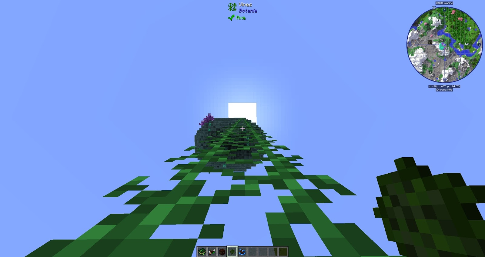

### Horn of the Wild
The Horn of the Wild, when used, will break all grass blocks with a 25x25 radius, the grass blocks will drop their seeds! This Horn can also be modified to break Leaves and Snow.

### Assembly/Manufacturing Halo
The Assembly Halo is a portable crafting tool added by Botania. When held, a ring divided into 12 segments will appear around the player. Right-clicking on the Crafting Table segment will open the crafting interface. The other 11 segments can hold one recipe each.

Right-clicking on an empty one will set it to the last recipe made in the crafting segment. Right-clicking a slot with a recipe will craft the item once using items from the player's inventory. Shift-left clicking will remove the recipe.

The Manufactory Halo in addition to all functionality of Assembly Halo, it will automatically craft all set recipes as long as the halo is not held.

### Vitreous Pickaxe
This pickaxe is intended to be used with just glass, it will prevent the glass from breaking when trying to pick it up, think of this as a cheap Silk Touch pickaxe for Glass.

### Worldshaper's Sextant
The Worldshapers Sextant is used to help with building circles. Holding Right-Click on a block will show a halo around the block, in the middle of the screen a circle will appear with a number, the number is the size of the circle, while still holding Right-Click and moving your mouse you can change the size of the circle. Letting go of Right-Click will spawn ghost cobblestone of the circle.

Filling the entire circle preview with blocks will remove it, displaying a message "Structure Complete!".

Shift right-clicking with the sextant will remove the circle preview if one exists.

### Vine Balls
When thrown against a wall these will create a climbable ladder. These can be used in combination with the Livingwood slingshot, this will cause the Vine Balls to ignore gravity allowing you to shoot these almost anywhere.

### Spellbinding Cloth
This cloth will remove enchants from items at the cost of durability.

