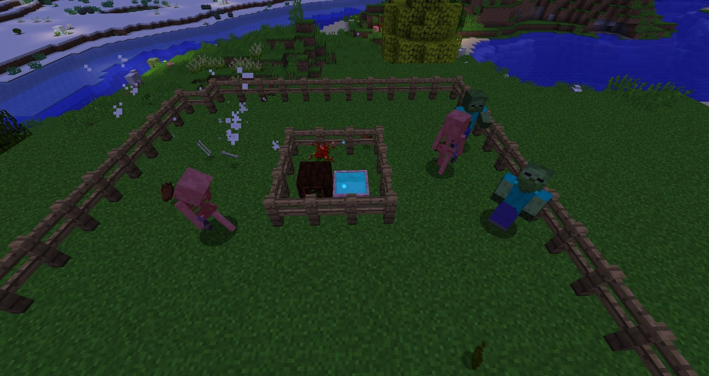
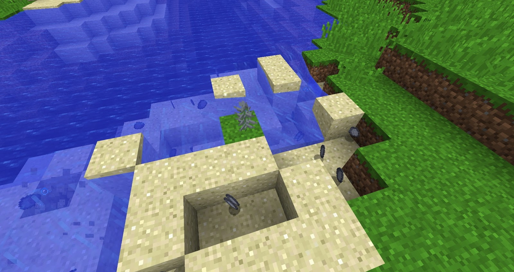

Now that you have a healthy supply of Mana (thanks to the Endoflame or the Hydrangea) you will probably wonder what can be done with Mana, what function it has and how it can help us within our world.

There are currently 5 functional flowers that only need petals and Redstone Root to be crafted, some these flowers will all require Mana to function, you can set these next to Mana Pools to draw Mana from or you can bind a Mana Spreader to a flower that is a bit further away.

>>>>> Any flowers that are crafted with Redstone Root can be turned on and off via a Redstone signal.

### Bellethorne/Dreadthorne
The Bellethorne will use Mana to harm any living beings (except for players) within its radius. This flower can also be turned on and off with a Redstone signal. The Bellethrone is able to kill a zombie within a few seconds. The Dreadthorne is similar to the Bellethorne but it will only kill adult animals

### Clayconia
The Clayconia will convert any sand in its vicinity into Clay, this works up to 2 blocks below the flower within its radius. Sand will just pop into clay, this will need to be picked up otherwise it could cause lag or despawn.

