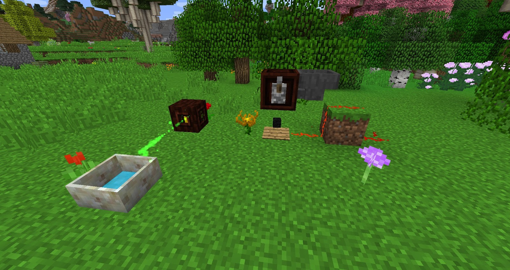

The Endoflame will produce mana when any burnable materials are dropped within its range, the Endoflame will burn anything that can be burned within a furnace apart from items that produce a by-product such as Lava Buckets (buckets being the by-product). The Endoflame will Consume any burnable material 1 at a time so throwing down lots of Coal will not speed up the process and could lead to coal despawning. 

Each product that is burned will burn for half of the time it takes to burn within a Furnace, Coal lasts for 1,600 ticks within a furnace and 800 ticks within an Endoflame. The Endoflame can only burn the equivalent of four times the value of a block of coal. One block of coal lasts 800 seconds (16000 ticks), which smelts 80 items this value x 4 is around 64,000 ticks, if a burnable item is over this value it will simply be wasted as an Endoflame only lasts up to 64,000 ticks. 

Most mod fuels will work with the Endoflame!

Throwing down coal is not the most efficient way of setting up an Endoflame, Ideally, you will want a system that will generate Mana on its own, the only thing you might need to do is add coal. We know that throwing down a bunch of coal is a bad idea but we can make use of open crates.

Open Crates will drop any items deposited one at a time onto the ground below them at a constant rate. You can feed items into the Open Crate via hoppers or tubes from other mods. You can also control open crates with Redstone.
Set down the following items in order

Mana Pool - Mana Spreader  - Endoflame - Wooden Pressure Plate - Open Crate (on top of the pressure Plate) - Redstone - Dirt - Redstone on the Dirt - Redstone. 

Next, add a Lever onto the Open Crate and a Hopper attached to the Open Crate.

Fill the hopper with Coal (or any fuel of your choosing).

This will cause One coal to drop, the Endoflame to Eat the coal and burn it, another coal will drop but will not despawn, once the Endoflame is done with the first bit of coal it will eat the next one on the ground. This will continue forever until you run out of coal or when the Mana Pool, Mana Spreader and Endoflame are all FULL. 

It's a good idea to move the Mana from the Mana Pool where the Endoflame is located if you are off mining or exploring the world as these can fill rather quickly.

This setup is probably used by most people as their first automated Mana generation set up and as long as you keep an eye on it then it will always generate Mana. You can expand this set up with more Endoflames and Mana Pools.
