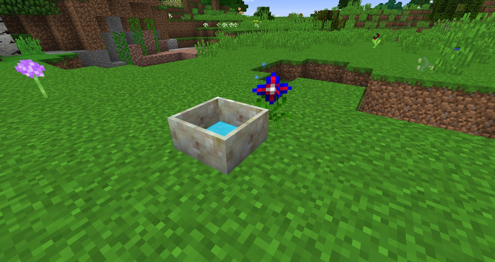

There are some flowers that provide utility and do not require any Mana to function, these will not help give you anything other than information or make life a little easier.

### Solegnolia
The Solegnolia will disable the effect of the Ring on Magnetization within its range.

### Bergamute
The Bergamute does not require any mana to work and also produces no Mana but it will reduce sounds around it by 85%. This flower is a great alternative to the Muffler block from Extra Utilities 2.

### Manastar
Manastars will tell you if you are gaining Mana or losing Mana within a certain range, placing them down near a Mana Pool and watching them will tell you if you are gaining Mana within the pool by giving off a Blue spark or a Red spark if you are losing Mana. Helpful if you want to glance over at the pool rather than using the Wand of the Forest.

