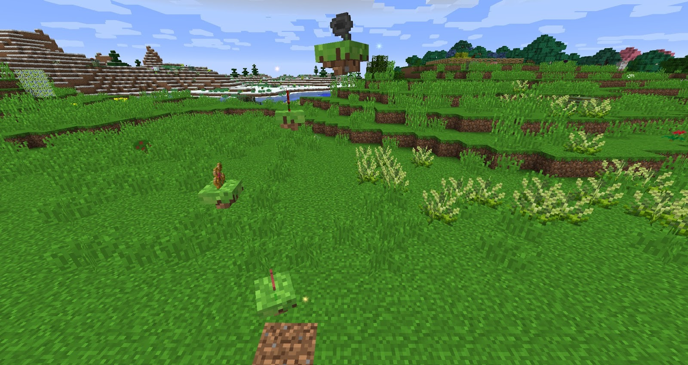

Our functional plants and glimmering plants can be a pain to plant in the ground especially if you have a contraption underground, also some flowers might have a large range which might be too big for you small build.

We can decrease the size of 8 of our functional flowers by throwing them into a Mana Pool that has an Alchemical Catalyst underneath it, this will give you a Petite version of the flower. The flower will still function the same as its normal size counterpart but will have a smaller range. These can be planted in dirt/grass just like any other flower. Remember not all flowers can be converted to Petite versions:

* Bellethorne
* Marimorphosis
* Agricarnation
* Hopperhock
* Rannuncarpus
* Clayconia
* Bubbell
* Solegnolia

Making flowers smaller is great but we can go one step further, using Pasture seeds (Throw grass into a normal Mana Pool) we can create floating flowers. All of the Glimmering Mystical Flowers can be turned into Floating Flowers, these flowers will give off light and can be put in mid-air!

We can go one step further with Floating Flowers, all functional and generating flowers can also be converted to floating versions by using any colour of regular Floating Flower. 

These floating flowers work just like the default counterparts but we can also convert some of these function floating flowers to Floating Petite versions of these flowers. These work just like Petite version of the flower but without having to plant them in Grass/Dirt.

Finally we can also change the type of dirt these flowers are floating on by Right-clicking these flowers with a Snowball or any type of Pasture Seeds (including Infestation Spores and Boreal Seeds) will turn the appearance of the flower to match and will affect the pickup delay of functional ones similarly to normal ones planted on Mycelium or Podzol.

