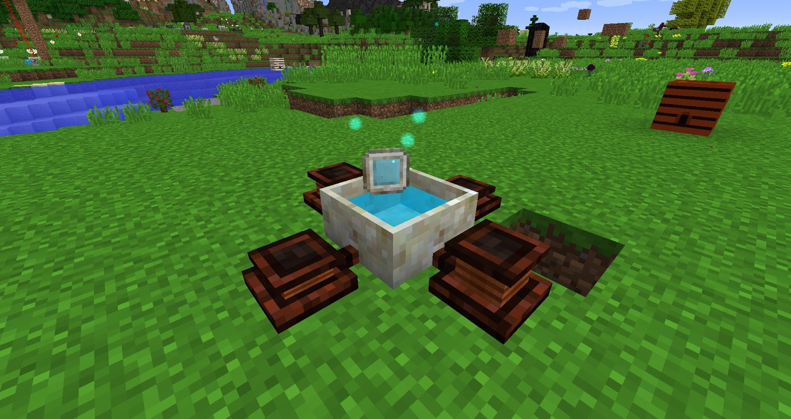

Transfering Mana from a Mana Pool into a Mana tablet can take a while, these processes can be sped up by attaching (up to 4) Manatide Bellows to the Mana pool. As soon as an item (that can accept Mana) is thrown into the Mana Pool the bellow will kick into action and speed up the transfer rate. 

Bellows can also be attached to a furnace to increase the speed at which items are smelted and increase its efficiency, you will need to Right-Click the bellows in order for them to work on a furnace.