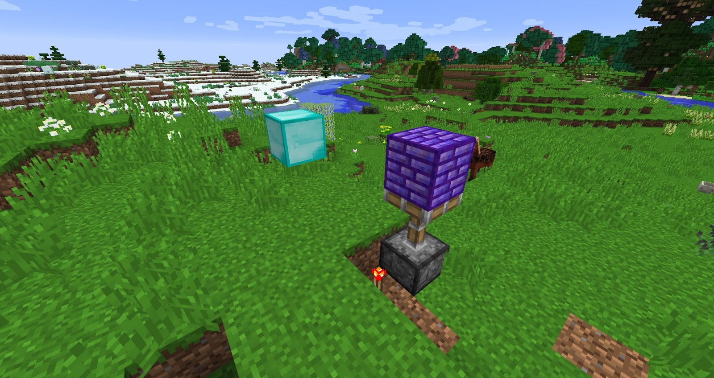

The force relay is probably one of the more complicated items when it comes to Botania, although it can be crafted early game it is recommended you get to grips with the basics of how Mana works before jumping into Force Relays.

>>>>> A few lenses will be covered within this section that has not been covered thus far within the guide. Some of these Lenses are not available till late game and are only here to best demonstrate the function of the Force Relay.

Force Relays have a few functions but they can be combined with Mana Spreaders and Lenses to create amazing machines.

Force relays on their own are basically a connection between 2 blocks wirelessly, they can move blocks and they can connect blocks. Please remember that Force Relays can not be broken with a Pickaxe but can only be picked up using the Wand of the Forest with Shift Right-Click.

First off Moving Blocks, any block bound to a force replay will mimic whatever happens to the Force Relay. To connect a Force Relay to a block you will need to set your Wand to bind mode and then Right-click the Force Relay, you should hear a beep, then right-click the target block, this should also give you a beep.

If you move the force relay with a piston, the block that has been bound with the force relay will also move in the same direction. The only exclusion to this is sticky pistons, any force Relays moved with the sticky piston will not move the target block. You can only **PUSH** blocks with the Force Relay.

Next, we can connect blocks to the force relay, in essence, whatever happens to the Force Relace will also happen to the connected block. A great example of this would be firing a Mana Pulse (using a Mana lens: warp) into the bottom of the force relay, this same effect will happen to whatever block has been connected to the Force Relay, in this instance, the Mana Burst will come out of the TOP of the connect block. As we cant teleport pulses the warp Mana lens is needed, this lens will strip any Mana from the pulse, this was nerfed intentionally.

“A pulse entering a force relay exits the bound block on the opposite side without interacting with it”

Now the Warp lens on its own does nothing but if combined with the Bore Lens it will break blocks as the pulse travels. It's important to know that this pulse will not break other force relays or pistons 

Hopefully, this explains Mana Relays a bit better.
