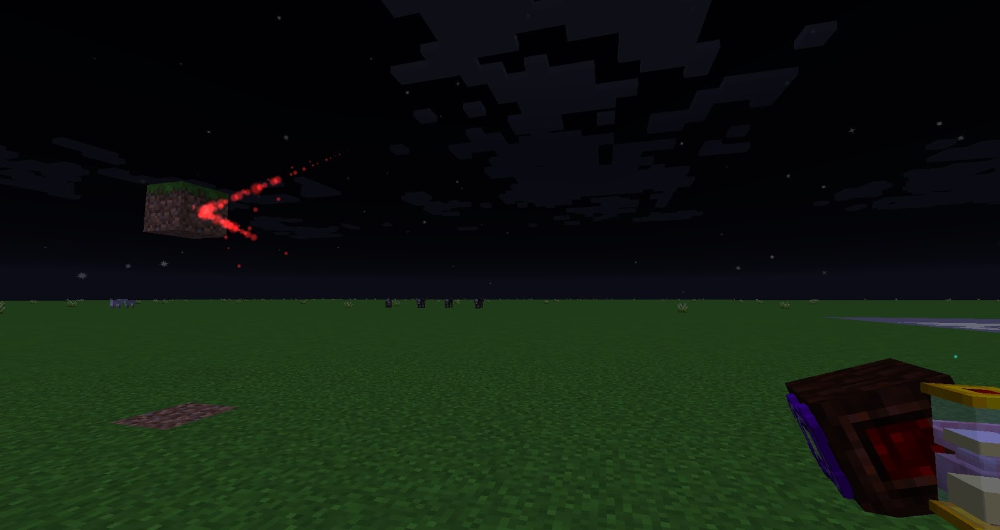

When installed on a Mana Spreader, this Lens causes mana bursts to bounce off of blocks they hit rather than dissipating. The burst will travel the opposite direction after bouncing off of a block, so a burst fired straight at a block will bounce back to the spreader that fired it.

