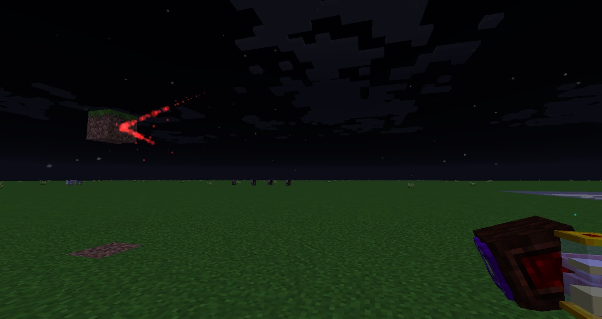

Lenses can be added to any Force Relay (right-clicking with lense in hand) and will augment the pulse, some of these lenses can also be combined with each other to give both desired effects, the same 2 Lenses can not be combined. Some Lenses can only be used with Pulse Mana Spreaders as these can be linked to ANY block.

### Coloured Lenses
Lenses can be combined with any dye to change the colour of the beam sent from a mana Spreader, Mana Pearls can also be combined with Lenses to create a rainbow effect.

### Mana Lens: Velocity
When installed on a Mana Spreader, this Lens causes each mana burst fired to travel faster. As a trade-off, the mana burst will carry less mana, to begin with, and the usual range of 12 blocks before losing mana is reduced.

### Mana Lens: Potency
When installed on a Mana Spreader, this Lens allows each mana burst to carry double the amount of mana. As a trade-off, the mana burst will travel more slowly and after the range of 12 blocks, mana will dissipate at a faster rate per block travelled.

### Mana Lens: Resistance
When installed on a Mana Spreader, this Lens increases the range that a mana burst can travel before losing mana from 12 blocks to 21 blocks. As a trade-off, the burst will travel more slowly.

### Mana Lens: Efficiency
When installed on a Mana Spreader, this Lens makes mana bursts lose mana at a slower rate. As a trade-off, the range the mana burst can travel before this loss starts is reduced.

### Mana Lens: Messenger
When installed on a Mana Spreader, this Lens decreases mana bursts' mana usage and increases their travel distance and speed. It can be used for interactions with blocks that require mana bursts itself and not mana in them, such as Drum of the Wild, Mana Detector and Animated Torch.

### Mana Lens: Bounce
When installed on a Mana Spreader, this Lens causes mana bursts to bounce off of blocks they hit rather than dissipating. The burst will travel the opposite direction after bouncing off of a block, so a burst fired straight at a block will bounce back to the spreader that fired it.

### Mana Lens: Gravity
When installed on a Mana Spreader, this Lens causes mana bursts to arc downwards as they travel. These bursts also have an increased range before beginning to lose mana.

### Mana Lens: Bore
When installed on a Mana Spreader, this Lens causes mana bursts to break any blocks they encounter. Each block broken in this way consumes a small amount of mana from the burst.

### Mana Lens: Damaging
When installed on a Mana Spreader, this Lens causes the mana bursts to damage any entities it crosses in its path. The burst will deal 4 damage when it touches an entity, it will consume a small amount of mana each time damage is dealt.

### Mana Lens: Phantom
When installed on a Mana Spreader, this Lens allows mana bursts to travel through blocks instead of dissipating on them. The usual range of 12 blocks before the burst loses mana is reduced.

### Mana Lens: Magnetizing
When installed on a Mana Spreader, this Lens creates mana bursts that are attracted to nearby mana accepting blocks. These bursts will travel more slowly.

### Mana Lens: Entropic
When installed on a Mana Spreader, this Lens creates mana bursts that explode on contact with anything that is not a mana accepting block.

### Mana Lens: Influence
When installed on a Mana Spreader, this Lens causes any nearby item sprites, experience orbs, or falling blocks to travel with the mana bursts to their destination. The influence has a range of 3 blocks in every direction from the mana burst itself.

### Mana Lens: Weight
When installed on a Mana Spreader, this Lens makes any block hit by its mana bursts affected by gravity. Blocks hit by this mana burst will fall with the same mechanics as Sand and Gravel if there is no block beneath them.

### Mana Lens: Kindle
When installed on a Mana Spreader, this Lens gives mana bursts the ability to set any blocks they hit on fire. This does not affect living entities. When hitting a Nether Portal it can both ignite it and close it. Fires started by this Lens follow normal fire spread mechanics.

### Mana Lens: Force
When installed on a Mana Spreader, this Lens makes mana bursts effect blocks in the same way a piston would. The block hit by this mana burst will be pushed in the same direction that the burst was travelling.

### Mana Lens: Flash
When installed on a Mana Spreader, this Lens makes mana bursts create a decorative flame of light on contact with a block. This flame will have the same colour as the mana burst that created it. Upon contact with one of these decorative flames, the mana burst created by this lens will extinguish it.

