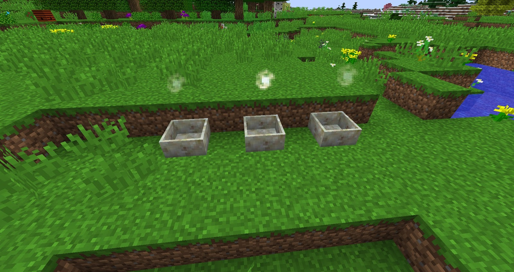

Mana Sparks can be thought of as wireless Mana transmission before you start placing Sparks around your world it's important to know that Mana Sparks will only work with certain Botania rituals such as Terrestrial Agglomeration Plates, Mana Pools and Mana Enchanters.

Mana spreads can only send a limited amount of mana and can only send Mana in pulses, the Mana Spark is able to transfer a huge amount (1000 Mana per tick) of Mana very quickly, this is helpful when enchanting and moving Mana around when crafting higher level items.

Mana Sparks have a 25x25x25 range and will look for other Mana Sparks to connect
 To. On their own sparks just talk to each other and move Mana where it is needed. They are very basic and are necessary to craft Terra Steel. Sparks will only pull or push Mana to objects that have a Spark above them, if you are storing Mana in a few Mana Pools in 1 area and you are crafting in a different area you will need to put Sparks above all the Mana pools you want to drain from. 

It’s also important to know that these basic Sparks have very limited use and are mainly used for crafting Terra Steel, Enchanting and transferring from Mana Pools, these Mana pools need a Spark above them and need to be near said crafting stations

Sparks can also be hidden with phantom ink and can also be colour with floral powder.
