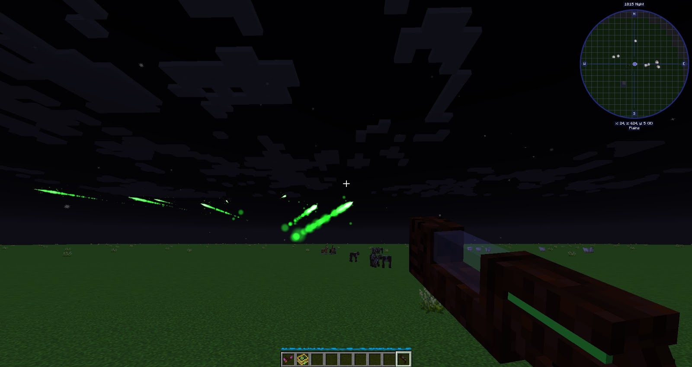

Sometimes you just need a shot of Mana to kick start a project, or you want to test a lens out to see what a certain combination does. The Mana Blaster is just the thing, on its own, it will shoot a blast of Mana knocking the player back a little when combined with a lense it can be used to test all kinds of combinations. The Mana Blast can be thought of as a handheld Mana Spreader shooting it into an empty Mana Pool will slowly fill up the Pool The Mana, these blasts are 5 times faster than a normal Mana Spreader but hold 25% less mana. There is a short 1.5-second cooldown when firing the Mana Blaster, this is removed while in creative mode. The Mana Blaster will pull Mana from a player's inventory (via a Mirror or a tablet), putting it in a blank crafting grid will remove the lense.

The Mana Blast can only hold one Lense at a time but by crafting a Lense Clip and combining it with the Mana Blaster it can hold up to 6, these can be added via a crafting grid and scrolled thought using Shift.