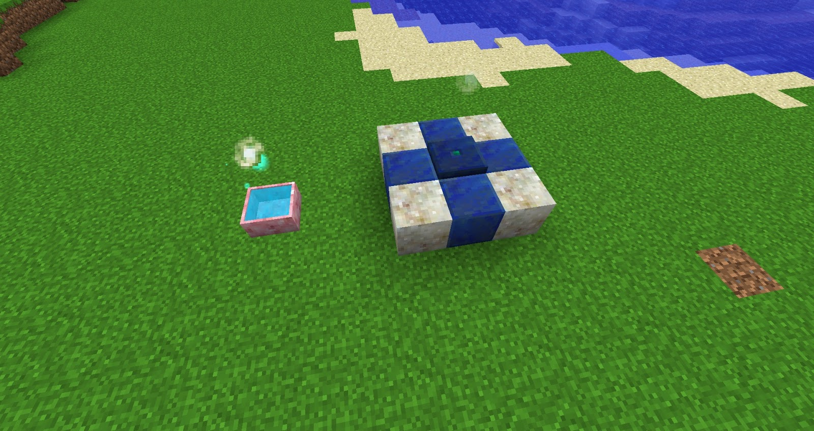

Terrasteel is the next tier of metal within Botania and it requires about half a Mana Pool of Mana to craft (around 500,000). You will need to craft a bunch of these so hopefully, you have a few Endoflame farms.

You will also require Mana Sparks since using a Mana Spreader could lead to the craft failing and wasting Mana. If a craft does fail then any Mana Spent will not be deposited back into any Mana Pools but instead will just vanish.

Set down 5 Livingrock and 4 Lapis Lazuli blocks, on top of the middle block you must place down a Terrestrial Agglomeration, a spark must be put on top of the Terrestrial Agglomeration before crafting can begin.

Before you start trying to craft anything make sure you have at least half a Mana pool of Mana, otherwise and crafting will fail. Failed crafts will result in a Mana loss

To begin crafting Terra Steel, Right-Click 1 Manasteel, 1 Mana Pearl and 1 Mana diamond onto the Terrestrial Agglomeration. Swirls will happen once crafting begins and after a short time, you will be greeted with 1 terra steel. It’s a good idea to make at least 5 and more if you wish to make tools and weapons

Ensure you are not to close when crafting, picking these items up will result in the crafting failing. Items that are thrown down have the same 5 minute time as normal items have when thrown into the world, ensuring you have enough Mana before crafting.

Once crafting is complete you will hear a sound!