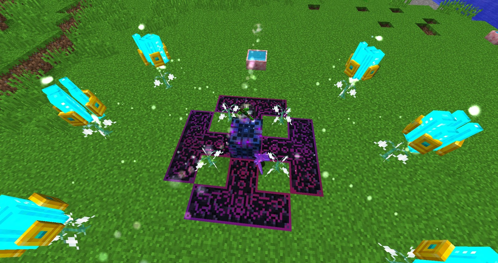

The Mana enchanter is a multiblock structure, the full material list need can be found within the Lexica. Once built it must be Right-Clicked with the Wand of the Forest to complete the structure. 

The Mana Enchanter can be used to enchant items with books, the difference is that these books will not be consumed but at the cost of a Mana, the rarer the enchant the more Mana the process will cost. The items that you wish to be enchanted must have no enchant on them and the books should have 1 enchant on them if there are more then only the first enchant will be used.

To start an enchant you must Right-click the item into the Mana Enchanter and then throw down the desired books, next the Mana Enchanter must be right-clicked with the Wand of the Forest. Do not break any of the structures blocks, this will cause the Enchant to fail and Mana to be wasted.  The books may be picked up again once the obsidian inlay changes colour.