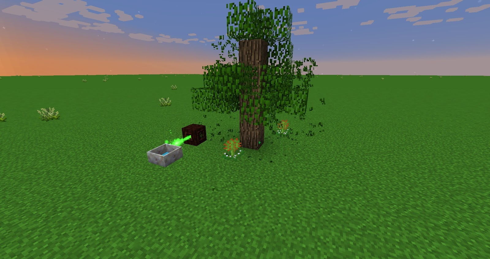

Munchdews will eat nearby tree leaves and generate Mana, any leaves eaten will not drop saplings or any other items, once eaten the flower will have a small cooldown (60 seconds) before it can eat again.

