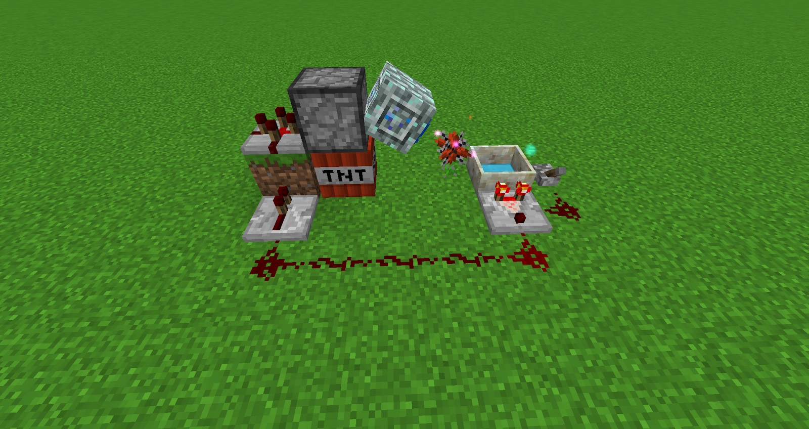

This flower will absorb TNT blasts and generate a huge amount of Mana practically nullifying the explosion. This flower will only absorb blasts if it has NO Mana stored within it. It’s a good idea to carry a Benevolent Goddess Charm when trying out any sort of automation setups as these will stop blocks from breaking from TNT.

[https://youtu.be/M07Fabjw1kg](https://youtu.be/M07Fabjw1kg)

To automate this flower does require further research into Botania, for late-game its perfect and can be a great source of mana, play around with this with caution.
