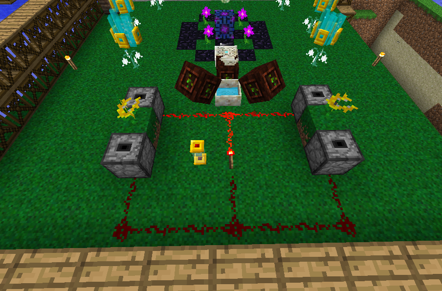

This flower will eat any food to generate Mana, the drawback is that the flower can only eat one item of food at a time. The time it takes to eat food and generate Mana before it can eat again depends on how many food points the food restores. The steak will take 4 seconds, An apple will take 2 seconds and bread 2 and a half. 

Food items' saturation values are ignored. While a Gourmaryllis is digesting a piece of food, it will still pick up additional food items. However, all items after the first will be ignored and destroyed. 

Gourmaryllis have reduced effectiveness every time you feed them the same food.

The above is an automation example by [u/ForumWarrior](https://www.reddit.com/r/feedthebeast/comments/7mblot/botania_simple_gourmaryllis_automation/) which feeds the Gourmaryllis different food automatically.  