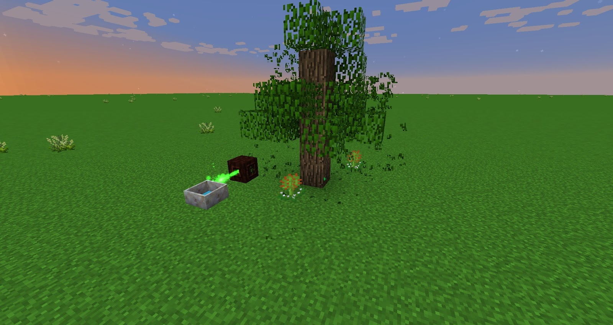
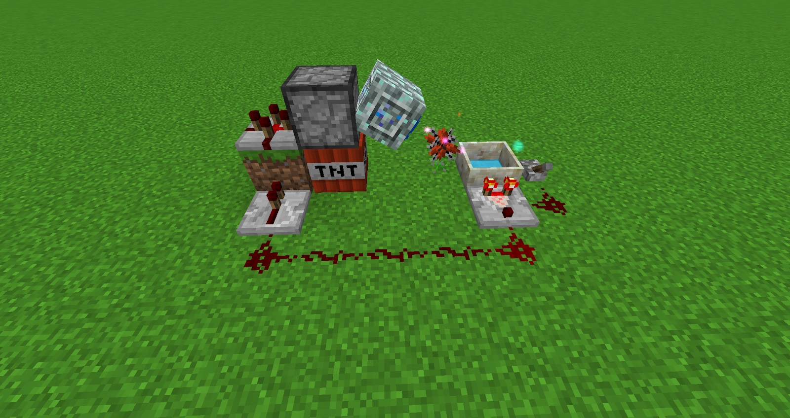
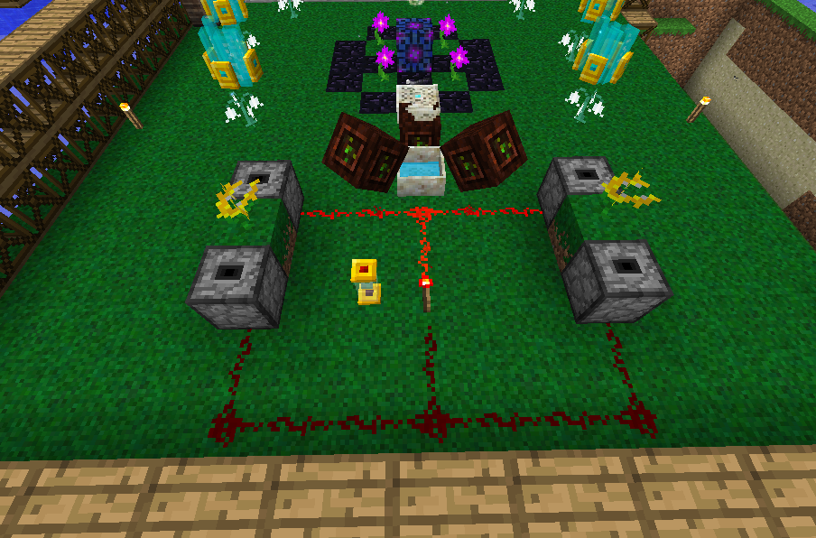

These advanced generating flowers can be made with some of the runes you now have access to, some of these can be automated and some of these generate more Mana.

### Therma Lilly
The Therma Lilly will suck up any lava near it (this must be at the same height)  and generate a huge amount of Mana for 45 seconds, the only downside to this flower is that it has a 5 minute cool after its 45-second timer is up. Any lava that is near the flower during this 5-minute cooldown will be destroyed and the plant will not generate any Mana instead it will start its 5-minute cooldown window again.

### Rosa Arcana
The Rosa Arcana will absorb Mana from experience orbs on the ground, it will generate more Mana from the players experience than from experience orbs on the ground.

### Munchdew
Munchdews will eat nearby tree leaves and generate Mana, any leaves eaten will not drop saplings or any other items, once eaten the flower will have a small cooldown (60 seconds) before it can eat again.

### Entropinnyum
This flower will absorb TNT blasts and generate a huge amount of Mana practically nullifying the explosion. This flower will only absorb blasts if it has NO Mana stored within it. It’s a good idea to carry a Benevolent Goddess Charm when trying out any sort of automation setups as these will stop blocks from breaking from TNT.

[https://youtu.be/M07Fabjw1kg](https://youtu.be/M07Fabjw1kg)

To automate this flower does require further research into Botania, for late-game its perfect and can be a great source of mana, play around with this with caution.

### Kekimurus
This flower will eat cakes near it to generate mana. Every 4 seconds, the flower attempts to consume one slice of Cake in an 11×11×11 area around itself, producing 1,800 Mana per slice, resulting in 10,800 per Cake.

A Kekimurus can store 9,001 Mana internally and can be bound to a Mana Spreader within 6 blocks of itself to transfer its Mana. There are many builds that automate this flower and can also be done just with Botania:

[https://youtu.be/zdMmVTysN5A](https://youtu.be/zdMmVTysN5A)

### Gourmaryllis
This flower will eat any food to generate Mana, the drawback is that the flower can only eat one item of food at a time. The time it takes to eat food and generate Mana before it can eat again depends on how many food points the food restores. The steak will take 4 seconds, An apple will take 2 seconds and bread 2 and a half. 

Food items' saturation values are ignored. While a Gourmaryllis is digesting a piece of food, it will still pick up additional food items. However, all items after the first will be ignored and destroyed. 

Gourmaryllis have reduced effectiveness every time you feed them the same food.

The above is an automation example by [u/ForumWarrior](https://www.reddit.com/r/feedthebeast/comments/7mblot/botania_simple_gourmaryllis_automation/) which feeds the Gourmaryllis different food automatically.
Narslimmus
The Narslimmus will consume any natural Slime in a 5×5×5 area around it. The amount of Mana generated is based on the slime's size:
Mana=1200\times 2 Size -where size corresponds to the size of the slime (smallest = 1, medium = 2, large = 4).

It will not consume Slimes spawned by artificial means. Killed slimes do not split or drop any items.

