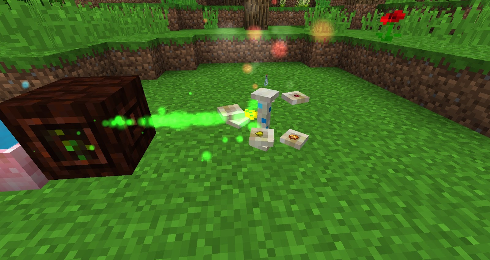

Brewing with Mana can give much better results than the traditional way of making potions. Vials hold up to 4 charges of a potion and Flasks hold up to 6. Initially, you will only be able to craft Vials (4 charges) but as you move on with Botania flasks will be available. 

To start brewing you will need to place down a Brewing stand and have a Mana spreader aimed at it. Next you can right-click the Vial into the stand as well as the required ingredients. Once all the ingredients are in the stand crafting will start, once finished the potion will pop off the brewing stand.

| Name | Effect | Ingredients |
|-|-|-|
| Brew of Fleetfeet | Speed 2 | Nether Wart, Sugar, Redstone |
| Brew of Vigor | Strength 2 | Nether Wart, Blaze Powder, Glowstone Dust |
| Brew of Adrenaline | Haste 2 | Nether Wart, Sugar, Gold Nugget |
| Brew of Mending | Instant Health 2 | Nether Wart, Glistering Melon, Potato |
| Brew of Upsurging | Jump Boost 2 | Nether Wart, Feather, Carrot |
| Brew of Revitalization | Regeneration 2 | Nether Wart, Ghast Tear, Glowstone Dust |
| Brew of Restoration | Regeneration | Nether Wart, Ghast Tear, Redstone Dust |
| Brew of Fortitude | Resistance 2 | Nether Wart, Iron Ingot, Leather |
| Brew of Magmaskin | Fire Resistance |  Nether Wart, Magma Cream, Netherrack |
| Brew of Gills | Water Breathing |  Nether Wart, Prismarine Shard, Glowstone Dust |
|Brew of Cloaking | Invisibility | Nether Wart, Snowball, Glowstone Dust |
| Brew of Owlsight | Night Vision |  Nether Wart, Spider Eye, Golden Carrot |
| Brew of Shielding | Absorption 4 | Nether Wart, Golden Apple, Potato |

Aside from Simple Brews there are also some more complicated brews:

| Name | Effect | Ingredients |
|--|--|--|
| Brew of Overload | Strength 4, Speed 3, Weakness 2, Hunger 2 | Nether Wart, Blaze Powder, Sugar, Glowstone Dust, Mana Steel Ingot, Spiders Eye
| Brew of Crossed Souls | HP Regen after Kill | Nether Wart Soul Sand Paper Apple Bone |
| Brew of Feather Feet | Immune to fall damage | Nether Wart Feather Leaver Wool |
| Brew of Vanity’s Emptiness | 128 Block Radius hostile mobs will not spawn | Nether Wart Raw Fish Quartz Golden Carrot |
| Brew of Crimson Shade | Mobs will spawn in a 64 block Radius regardless of the light level. | Nether Wart Fermented Spiders Eye Lapis Lazuli Fire Charge Iron Ingot
| Brew of Marine Allure | Higher Proficiency catching Fish, will also catch fish and loot faster | Nether Wart Raw Fish Nether Quartz Golden Carrot
| Brew of Absolution | Clear all negative and positive potion effects | Nether Wart Quartz Emerald Melon |

