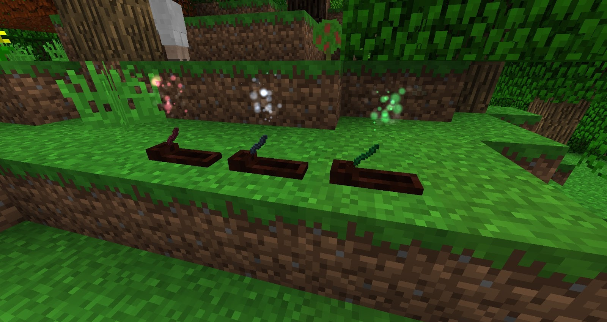

Potions are great but require inventory space, Incense can be made in the same way as Brews but can be placed within an Incense plate. When placed within a plate they will give the infused Brew effect within a 30 block radius for an hour and a half. The only drawback is that once lit (with flint and Steel) they can not be removed and they cost 10 times as much Mana to produce.

Incense plates can be fed with hoppers and other inputs and will give a Redstone signal (via a Comparator) of 1 when it has a stick and 2 when it is burning.

The Following Brews can be infused into Incense:

* FleetFeet - Speed 2
* Vigor - Strength 2
* Adrenaline - Haste 2
* Upsurging - Jump Boost 2
* Revitalization - Regeneration 2
* Restoration - Regeneration
* Fortitude - Resistance 2
* Magmaskin - Fire Resistance
* Gills - Water Breathing
* Cloaking - Invisibility
* OwlsightCrossed Souls - Night Vision
* Crossed Souls - HP Regen after Kill
* Feather Feet - Immune to fall damage
* Vanity’s Emptiness - 128 Block Radius hostile mobs will not spawn
* Brew of Crimson Shade - Mobs will spawn in a 64 block Radius regardless of the light level.
* Brew of Marine Allure - Higher Proficiency catching Fish, will also catch fish and loot faster
