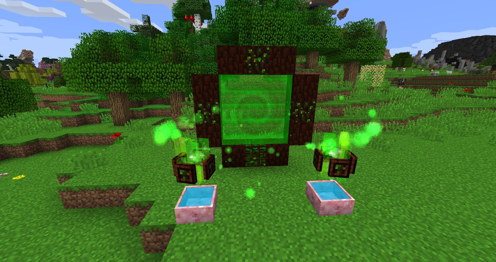

By now you should have a decent supply of mana (4 or more full pools) and have grasped the concept of flower and how to generate and best use mana. Next up we want to open a portal to Alfheim, this portal costs a lot of Mana to keep open but can not be entered like Nether Portals. Instead, items are thrown into the portal and their Alfheim counterparts are given back in return.

In order to open this portal you will need 2 full pools of Mana, this portal can be visualized via the Lexica if you need help setting it up. 

Once the portal has been built you need to ensure you have 2 full mana pools in front of it as well as sparks above these mana pools, lastly right-click the centre gateway core (with your Wand of the forest) and the portal will open.

You can now throw items into this gateway, every time an item is thrown in one is given back out, throw your Lexica in first! Each item thrown in and out will cost a little mana.

You do not need to keep this portal open all the time, breaking a block will close the portal so once you are finished with it it's best to turn it off until you need it again. I would advise making items in bulk before turning it off.
