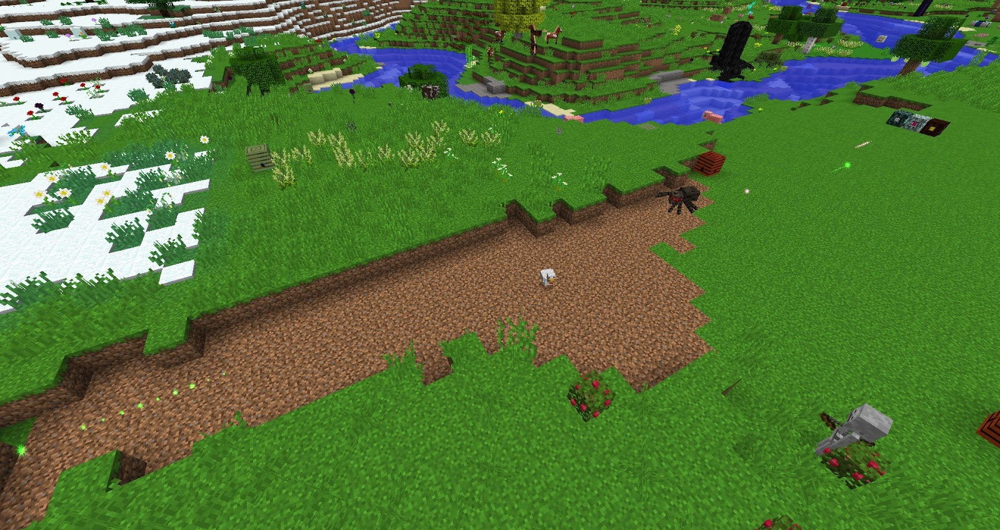
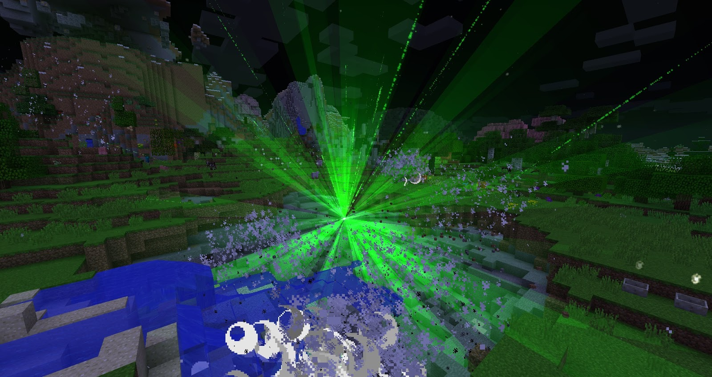

You should have at least by now fought the Gaia Guardian a few times, this should give you enough Gia spirit to craft the final items within Botania

### Cloak of Sin
When worn in the Baubles Body slot, the Cloak will damage all nearby monsters for the same amount the wearer was damaged by and go on a 10-second cooldown. The Cloak does not trigger on unblockable damage like magic or fall damage.

### Globetrotter’s Sash
When worn in the Baubles Belt slot, it will increase the wearer's speed by about 2.8 m/s, their jump height by 2 blocks, and grant them step assist if not sneaking. In addition, the player will take 3 less points of fall damage. The Mana cost of these abilities is 2 Mana per second.

### Crimson Pendant
The Crimson Pendant is an upgrade of the Pyroclast Pendant. Its entry in the Lexica Botania is initially hidden until the player acquires Elven Knowledge. When worn, the player will become immune to fire or lava damage and will also be unable to be set on fire.

### Nimbus Amulet
The Nimbus Amulet, when worn by the player in the Baubles Amulet slot, the player will be able to triple jump, adding one jump compared to the Cirrus Amulet. Jumping in mid-air will nullify all fall damage and downwards momentum.

### Life Aggregator
The Life Aggregator allows the player to move Monster Spawners by right-clicking a Monster Spawner with it. This will absorb the Spawner into the Life Aggregator. Right-clicking the Aggregator to any block will place it down and release the Spawner, which will break the Aggregator in the process.

### Rod of the Unstable Reservoir
By using Mana from a player-carried Mana Tablet, the Rod of the Unstable Reservoir can create homing missiles which attack nearby foes.

When used, missiles will spawn above the user in quick succession if there are any hostile mobs within a 12 block radius. The cost of spawning a single missile is 120 Mana. These missiles deal 7 points of damage and home onto any monsters nearby. Missiles will despawn if no valid target is in their range.

When this Rod is given to a Livingwood Avatar, it will create homing missiles, though at a slower rate compared to the player, using 40 Mana per missile.

### Shard of Laputa
When used on a block, it will start lifting the nearby ground 42 blocks up, slowly creating a floating island. There are 20 varieties of the shard, each with higher Shard Power, up to Shard Power XX.

An island created by the level I shard has a radius of 14 blocks. Each additional level of Shard Power increases the radius by 1 block, up to a maximum of a radius of 33 blocks.

In terms of the dimensions the lifted island would take up, a level I shard will lift a sphere of dimensions 27x27x27 blocks, while a level XX shard will produce a sphere of dimensions 65x65x65.

### Gaia Mana Spreader
The Gaia Mana Spreader is the highest tier of Mana Spreader available and allows for Mana bursts to travel longer without losing Mana.

The Gaia Mana Spreader can fire Mana bursts up to 48 blocks before suffering Mana loss, compared to the 20-block distance of the Elven Mana Spreader and the 12-block distance of the standard Mana Spreader. It also fires Mana bursts less frequently however due to its larger load. It cannot be crafted into a Redstone Mana Spreader.

### Manastorm Charge
When hit by a Mana burst, it will turn into a Manastorm Epicenter—an entity which spawns explosive Mana bursts (which explode with a power of 5) at an increasing rate. After 250 explosive bursts are spawned, the epicentre will stop spawning more, and explode after 10 seconds. The final explosion's power is 8 and starts fires.

### Worldshaper’s Astrolabe
It uses Mana to quickly place multiple blocks of the same type.

Shift right-clicking with the astrolabe on a block will set the Astrolabe to place that type of block. Shift right-clicking with it in the air will change the affected area, cycling through 3×3, 5×5, 7×7, 9×9 and 11×11.

While the Astrolabe is held when looking at a block, a preview of the effect is shown. Right-clicking will place blocks in the area shown in the preview, using 320 Mana per row of placed blocks; for example, placing blocks in an 11×11 area costs 11 x 320 = 3520 Mana. Blocks cannot be placed if the player's inventory does not contain enough blocks to fill the area,

Similarly to the Rod of the Shifting Crust, the astrolabe can use a Rod of the Lands, Highlands or Terra Firma to place Dirt for their standard mana cost. Rod of the Depths will do the same with Cobblestone. Black Hole Talisman will provide its contents for no additional cost.

A Hand of Ender in the user's inventory will allow the Astrolabe to use contents of the player's vanilla Ender inventory but will consume an extra 5 Mana per block placed, and the preview will not be shown.

### Charm of the Diva
If the player attacks a hostile mob while it is worn, that mob will become completely passive to the player and start attacking and killing other hostile mobs.

Only one mob can be bewitched at the time; the current one would have to be killed in order to bewitch another mob, and it is suspected that the bewitched mob will stay bewitched indefinitely.

### Cloak of Virtue
When worn in the Body slot, whenever the player takes damage, the Cloak will nullify it and go on a 10-second cooldown. The wearer is not protected from magic damage from sources like the Potion of Harming.

### Cloak of Sin
When worn in the Baubles Body slot, the Cloak will damage all nearby monsters for the same amount the wearer was damaged by and go on a 10-second cooldown. The Cloak does not trigger on unblockable damage like magic or fall damage

### Cloak of Balance
When worn in the Baubles Body slot, the cloak will halve the damage taken and deal the same amount of damage to the attacker when the wearer sustains damage, then go on a 10-second cooldown. The cloak does not trigger on magic damage like Potions of Harming.

### Crimson Pendant
When worn, the player will become immune to fire or lava damage and will also be unable to be set on fire.

### Flügel Tiara
When worn, the player can fly as if they were in Creative mode by consuming small amounts of Mana from a carried Mana Tablet. When in flight, white sparks trail behind the player.
Black Hole Talisman
